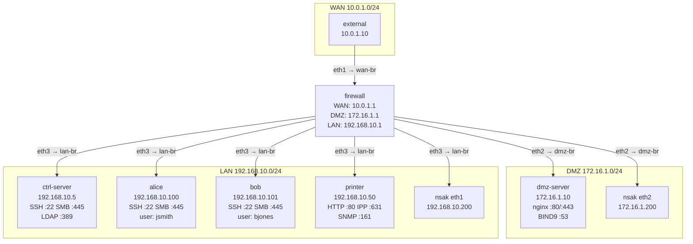

```mermaid
graph TD
    external["external\n10.0.1.10"]
    firewall["firewall\nWAN: 10.0.1.1\nDMZ: 172.16.1.1\nLAN: 192.168.10.1"]

    subgraph WAN["WAN 10.0.1.0/24"]
        external
    end

    subgraph DMZ["DMZ 172.16.1.0/24"]
        dmz_server["dmz-server\n172.16.1.10\nnginx :80/:443\nBIND9 :53"]
        nsak_dmz["nsak eth2\n172.16.1.200"]
    end

    subgraph LAN["LAN 192.168.10.0/24"]
        ctrl_server["ctrl-server\n192.168.10.5\nSSH :22  SMB :445\nLDAP :389"]
        alice["alice\n192.168.10.100\nSSH :22  SMB :445\nuser: jsmith"]
        bob["bob\n192.168.10.101\nSSH :22  SMB :445\nuser: bjones"]
        printer["printer\n192.168.10.50\nHTTP :80  IPP :631\nSNMP :161"]
        nsak_lan["nsak eth1\n192.168.10.200"]
    end

    external -->|"eth1 → wan-br"| firewall
    firewall -->|"eth2 → dmz-br"| dmz_server
    firewall -->|"eth2 → dmz-br"| nsak_dmz
    firewall -->|"eth3 → lan-br"| ctrl_server
    firewall -->|"eth3 → lan-br"| alice
    firewall -->|"eth3 → lan-br"| bob
    firewall -->|"eth3 → lan-br"| printer
    firewall -->|"eth3 → lan-br"| nsak_lan
```