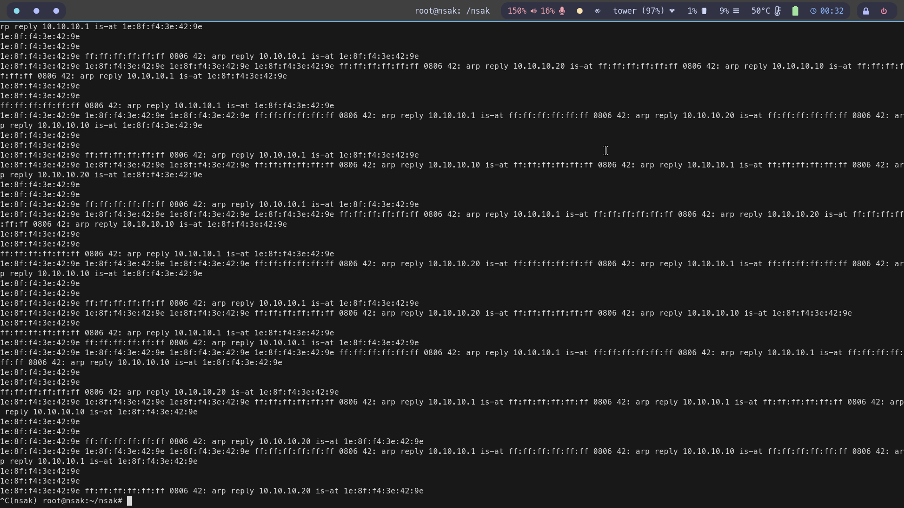
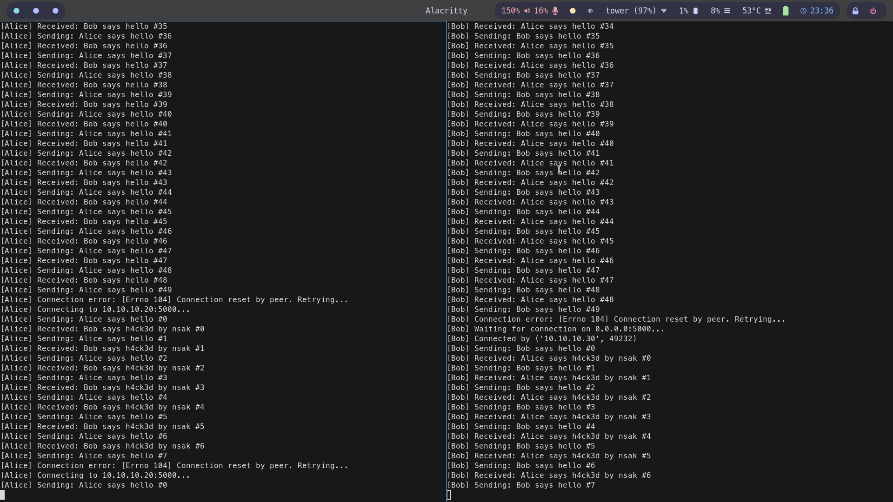

# MITM scenario in Simple TCP Client Server environment

## Simulate the MITM scenario with containers
For a simulation of a scenario in this environment without setting up any HW, you can use the following commands:
```bash
nsak scenario bulid mitm
nsak environment simulate simple_tcp_client_server mitm
```

## Example setup with real hardware

### Setup Simple TCP Client Server environment
First, follow the steps in the [README.md](../../../../environments/simple_tcp_client_server/README.md) of the Simple TCP Client Server environment to get a working client/server setup.

### Provision NSAK
Then, follow the steps in the [README.md](../../../../devices/bananapi_r4/README.md) of the Banana PI R4 directory to provision NSAK.

### Open three terminals

**Alice:**
```bash
ssh alice@10.10.20.10

cd nsak
uv run lib/environments/simple_tcp_client_server/alice.py
```

Alice will try to connect to Bob's server.

**Bob:**
```bash
ssh bob@10.10.20.20

cd nsak
uv run lib/environments/simple_tcp_client_server/bob.py
```

Bob will start a server and wait for Alice to connect.

Now you should see messages sent from Alice to Bob and vice versa.

**NSAK:**
```bash
# Connect via SSH (root:bananapi)
ssh root@10.10.20.30

cd nsak
source .venv/bin/activate

nsak scenario build mitm
nsak scenario run mitm
```

The MITM Scenario will execute the following steps:
1. Discover available interfaces
2. Discover all MAC addresses
3. Start the transparent TCP proxy
4. Start ARP spoofing for all MAC addresses found

Now you should see the intercepted messages sent from Alice to Bob and vice versa.
Additionally, the messages received by Bob and Alice will be manipulated.



